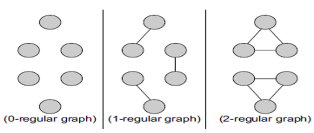
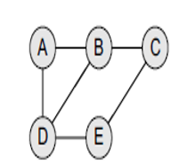
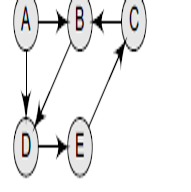
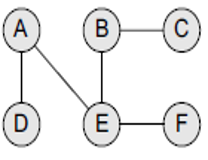
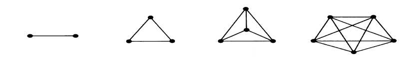
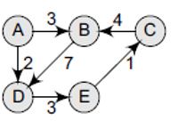
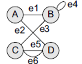
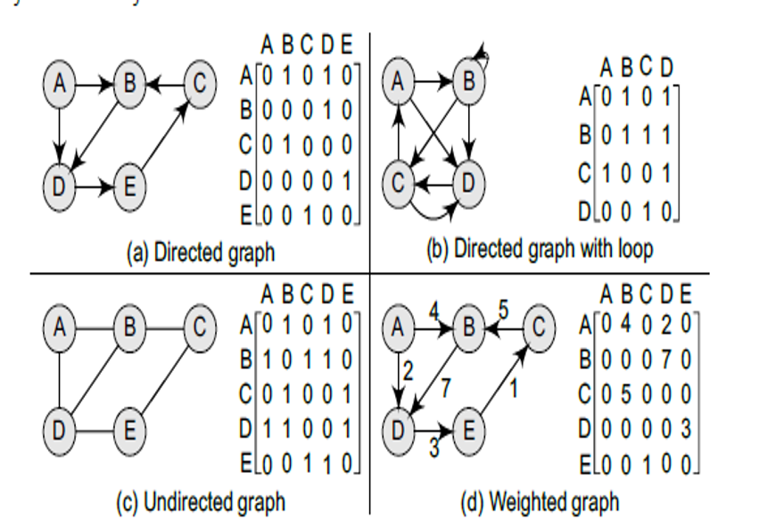
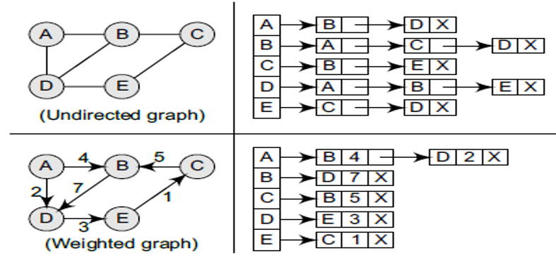
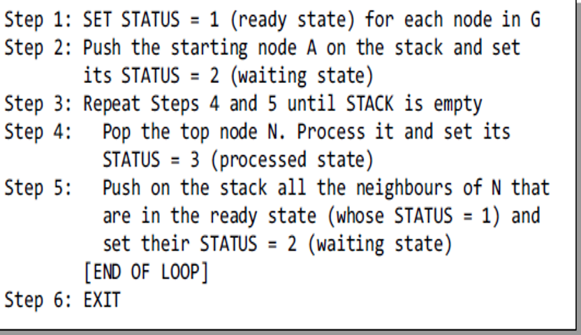

# Data-Structures-and-Algorithms
Lecture notes on Data Structures and Insights from self-learning

## Learning Roadmaps
- [ ] READING: Data Structures And Algorithms Made Easy By Narasimha Karumanch
- [ ] VIDEOS: [Jenny's DSA playlist](https://www.youtube.com/playlist?list=PLdo5W4Nhv31bbKJzrsKfMpo_grxuLl8LU)
- [ ] [Naso Academy DS playlist](https://www.youtube.com/playlist?list=PLBlnK6fEyqRj9lld8sWIUNwlKfdUoPd1Y)


## Contents
- [Graphs](#Graphs)


### Graphs
#### Glosary

- A **graph** G is defined as an ordered set (V,E), where V(G) represents set **of vertices(nodes)** and E(G) represents the **edges** that connect these vertices.
- **Adjacent and neigbors** - two vertices are adjacent/neigbors if there is an edge connecting them
- **Degree of node** - is the total number of edges containing the node. If deg(u) = 0, it means that u does not belong to any edge and such a node is known as an isolated node.
- **Size of a graph** - the total number of edges in it.
- **Path** - a finite or infinite sequence of edges which joins a sequence of vertices.
- **Closed Path** - A path P is known as a closed path if the edge has the same end-points. That is, if v0 = vn.
- **Simple path** -  A path that repeats no vertex, except that the first and last may be the same vertex.
- **Cycle** -  A path in which the first and the last vertices are same. 

**Regular graph** - graph where each vertex has the same number of neighbors. That is, every node has the same degree.


Graphs can be **undirected** and **directed**:

In an **undirected graph**, edges do not have any direction associated with them. So,nodes can be traversed from A to B as well as from B to A. 


In a **directed graph**, edges form an ordered pair. If there is an edge from A to B, then there is a path from A to B but not from B to A. 


**Connected graph** a graph is said to be connected if for any two vertices (u, v) in V there is a path from u to v. That is to say that there are no isolated nodes in a connected graph. 
<br> 

**Complete graph** A graph G is said to be complete if all its nodes are fully connected. That is, there is a path from one node to every other node in the graph. A complete graph has n(n–1)/2 edges, where n is the number of nodes in G.
<br> 

**Labelled graph or weighted graph** in a weighted graph, the edges of the graph are assigned some weight or length. 
<br> 

**Multiple edges** distinct edges which connect the same end-points. 

**Loop** an edge that has identical end-points is called a loop.

**Multi-graph** a graph with multiple edges and/or loops is called a multi-graph. 
<br> 

#### Terminology of a Directed Graph:
- **Out-degree of a node** - the out-degree of a node u, written as outdeg(u), is the number of edges that originate at u.
- **In-degree of a node** - the in-degree of a node u, written as indeg(u), is the number of edges that terminate at u.
- **Degree of a node** - the degree of a node, written as deg(u), is equal to the sum of in-degree and out-degree of that node. 
Therefore, `deg(u) = indeg(u) + outdeg`
- **Isolated vertex** - A vertex with degree zero. Such a vertex is not an end-point of any edge.
- **Pendant vertex** (also known as leaf vertex) - a vertex with degree one.

#### Representation of graphs:
- Sequential representation by using an adjacency matrix.
<br> 

This code creates a graph with adj matrix representation
```
void graph(){
int n; //number of vertices
int e; //number of edges
int u; //from vertex
int v; //to vertex

int matrix[n][n];
for (int i=1; i<=n; i++);
{
cout<<"Number of edges"<<i;
cout<<"From:";
cin>>u;
cout<<"To:";
cin>>v;
//For undirected graphs
matrix[u][v]=1;
matrix[v][u]=1;
  }
}
```
- Linked representation by using an adjacency list that stores the neighbors of a node using a linked list.
<br> 

This code creates a graph with adj list representation
``` 
void addEdge(vector<int> graph[], int u, int v){
graph[u].push_back(v);
graph[v].push_back(u);
}

void print(vector<int> graph[], int n){
    for (int i = 0; i < n; i++) {
        cout << "Vertex " << i << ": ";
        for (int j = 0; j < graph[i].size(); j++) {
            cout << graph[i][j] << " ";
        }
        cout << endl;
    }
}

int main() {
int n, e, u, v;
cout<<"Number of vertices ";
cin>>n;
cout<<"Number of edges ";
cin>>e;
vector<int> graph[n];
for (int i=0; i<=n; i++){
cout<<"From: ";
cin>>u;
cout<<"To: ";
cin>>v;
addEdge(graph, u,v);
print(graph, n);
 }
}

```

## Graph Traversal

### Depth-First Search
- About algorithm https://youtube.com/watch?v=iaBEKo5sM7w&feature=shares
- The DFS strategy is to go "deep" into the graph as far as possible
- Implemented by using stack
- Time complexity ` O(Vertices+Edges)
<br> 

```
#include <iostream>
#include <stack>
#include <vector>

using namespace std;

const int N = 100; // maximum number of nodes in the graph
vector<int> adjList[N+1]; // adjacency list of the graph
int status[N+1]; // status of each node in the graph

void dfs(int start) {
    stack<int> stk;
    stk.push(start);
    status[start] = 2;

    while (!stk.empty()) {
        int node = stk.top();
        stk.pop();
        cout << node << " "; // process the node here
        status[node] = 3;

        for (int neighbor : adjList[node]) {
            if (status[neighbor] == 1) {
                stk.push(neighbor);
                status[neighbor] = 2;
            }
        }
    }
}

int main() {
    int n, m; // n is the number of nodes, m is the number of edges
    cin >> n >> m;

    for (int i = 1; i <= m; i++) {
        int u, v; // edge between u and v
        cin >> u >> v;
        adjList[u].push_back(v);
        adjList[v].push_back(u); // remove this line for directed graphs
    }

    for (int i = 1; i <= n; i++) {
        status[i] = 1; // set all nodes to ready state
    }

    dfs(1); // start DFS from node 1

    return 0;
}
```
